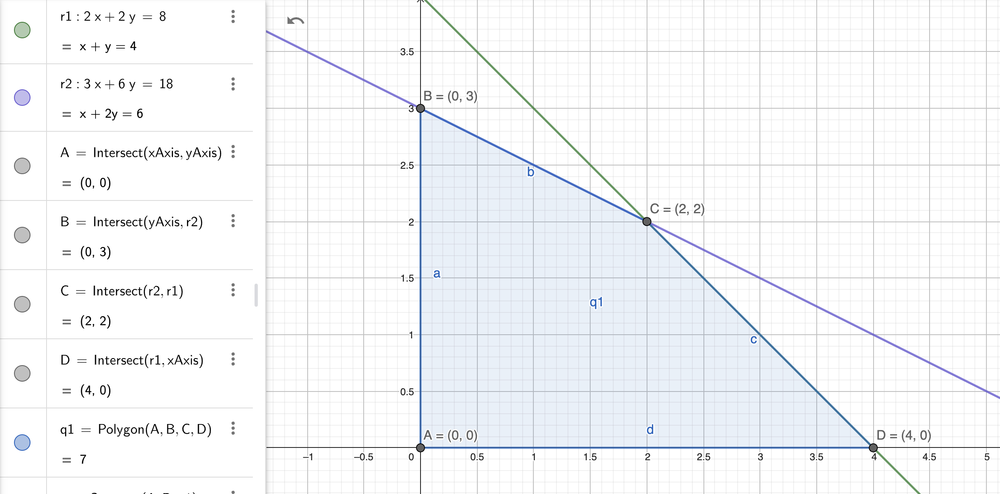
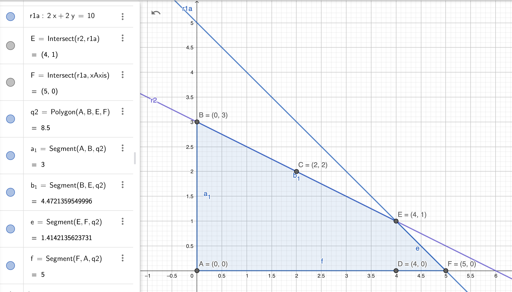
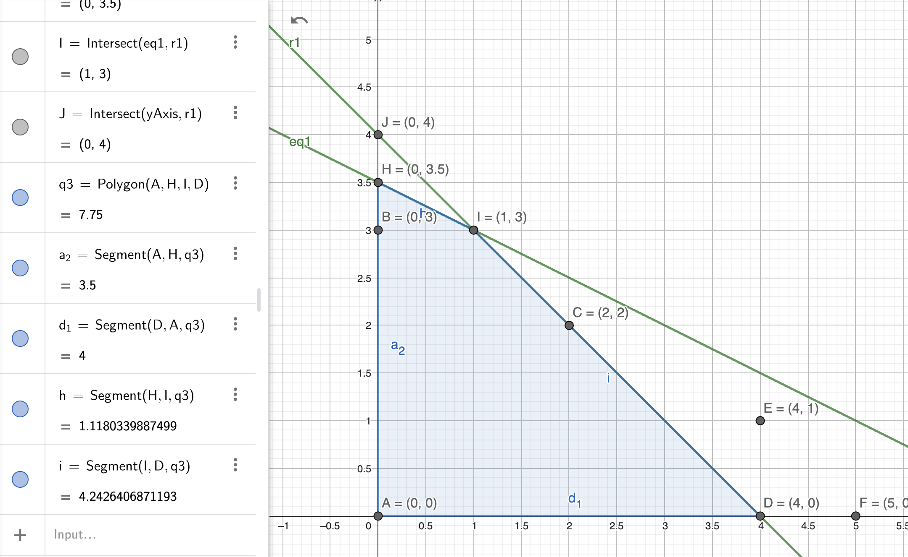

Una compañía fabrica dos productos, A y B. Los ingresos unitarios son $2 y $3, respectivamente. Las disponibilidades diarias de dos materias primas MP1 y MP2, utilizadas en la fabricación de los dos productos son de 8 y 18 unidades, respectivamente. Una unidad de A utiliza 2 unidades de la materia prima 1 y 3 unidades de la materia prima2, y una unidad de B utiliza 2 unidades de la materia prima 1 y 6 unidades de la materia prima 2.

(a) Determine el  precios dual de la  materia prima 1 y su intervalo de factibilidad.

(b) Determine el  precios dual de la materia prima 2 y su intervalo de factibilidad.

(c) Si la utilidad de cada producto cambia para el producto A a $ 4,  ¿Permanece el punto óptimo?,  ¿Cuál es el intervalo en de optimalidad?
La entrega de su tarea debe incluir el 
procedimiento para cada inciso.

1. Variables:

    $\textrm{Producto}_A \to x_1$

    $\textrm{Producto}_B \to x_2$

2. Función objetivo

    $\textrm{MaxZ} = 2x_1+3x_2$

3. Restricciones

    $\textrm{Disp. Materia Prima }_1 \to \textrm{ R }_1 : 2x_1 + 2x_2 \leq 8$

    $\textrm{Disp. Materia Prima }_2 \to \textrm{ R }_2 : 3x_1 + 6x_2 \leq 18$

    $\textrm{ R }_3 : x_1, x_2 \geq 0$

4. Graficar
    

5. Puntos esquina

    | $PE$ | $x1, x2$ | $Z = 2x_1 + 3x_2$ |
    | - | - | - |
    | $A$ | $0, 0$ | $Z=0$ |
    | $B$ | $0, 3$ | $Z=9$ |
    | ==$C$== |==$2, 2$== | ==$Z=10$== |
    | $D$ | $4, 0$ | $Z=8$ |

**a. Mover restricción 1 para obtener una $Z_b$**

$\textrm{Disp. Materia Prima}_1 \to \textrm{ R }_1 : 2x_1 + 2x_2 \leq 10$

|$PE$ |$x1, x2$ | $Z = 2x_1 + 3x_2$|
|-|-|-|
| $A$ | $0, 0$ | $Z=0$ |
| $B$ | $0, 3$ | $Z=9$ |
| $E$ | $4, 1$ | $Z=11$ |
| $F$ | $5, 0$ | $Z=10$ |

a.1) Precio Dual

$\frac{Z_b - Z_a}{L_{Z_b} - L_{Z_a}} = \frac{11-10}{10-8}=0.5$

Implica que sumar o quitar 1 unidad en la $\textrm{Disp. Materia Prima}_1$ afectará en $0.5$ al valor de $Z$.

a.2) Intervalo de factibilidad

| $\textrm{Punto B} \to (0,3)$ | $2x_1 + 2x_2 \to 2(0) + 2(3)$ | $6$  |
| ---------------------------- | ----------------------------- | ---- |
| $\textrm{Punto G} \to (6,0)$ | $2x_1 + 2x_2 \to 2(6) + 2(0)$ | $12$ |

$6 \leq \textrm{Disp. Materia Prima}_1 \leq 12$

**b) Mover restricción 2 para obtener una $Z_c$**

$\textrm{Disp. Materia Prima}_1 \to \textrm{ R }_1 : 3x_1 + 6x_2 \leq 21$

|$PE$ |$x1, x2$ | $Z = 2x_1 + 3x_2$|
|-|-|-|
| $A$ | $0, 0$ | $Z=0$ |
| $H$ | $0, 3.5$ | $Z=10.5$ |
| $I$ | $1, 3$ | $Z=11$ |
| $D$ | $4, 0$ | $Z=8$ |

b.1) Precio Dual

$\frac{Z_c - Z_a}{L_{Z_c} - L_{Z_a}} = \frac{11-10}{21-18}=0.33$

Implica que sumar o quitar 1 unidad en la $\textrm{Disp. Materia Prima}_2$ afectará en $0.33$ al valor de $Z$.

b.2) Intervalo de factibilidad

| $\textrm{Punto D} \to (4,0)$ | $3x_1 + 6x_2 \to 3(4) + 6(0)$ | $12$ |
| ---------------------------- | ----------------------------- | ---- |
| $\textrm{Punto J} \to (0,4)$ | $3x_1 + 6x_2 \to 3(0) + 6(4)$ | $24$ |

$12 \leq \textrm{Disp. Materia Prima}_2 \leq 24$

**c) Si la utilidad de cada producto cambia para el producto A a $ 4,  ¿Permanece el punto óptimo?,  ¿Cuál es el intervalo en de optimalidad?**

1. Variables:

    $\textrm{Producto}_A \to x_1$

    $\textrm{Producto}_B \to x_2$

2. Intervalo de optimalidad

    $Z = C_1x_1+C_2x_2$

    $\textrm{Optimalidad}= \frac{C_1}{C_2}$
    
    $R_1 : 2x_1 + 2x_2 \leq 8 \to \frac{2}{2}=1$ 

    $R_2 \to \textrm{ R }_2 : 3x_1 + 6x_2 \leq 18  \to \frac{3}{6}=0.5$

    $0.5\leq \frac{C_1}{C_2} \leq1$

4. Calcular si la nueva función objetivo coincide en el intervalo de optimalidad.

    $\textrm{Función objetivo} \to \textrm{MaxZ}: 4x_1+3x_2$

    $C_1=4, C_2=3$

    $\frac{C_1}{C_2}=\frac{4}{3}=1.33$

> *Respuesta.* La nueva función objetivo no entrá en el intervalo de optimalidad, lo cual implica que el punto óptimo cambiará. Comprobado gráficamente el nuevo punto será el $D$.