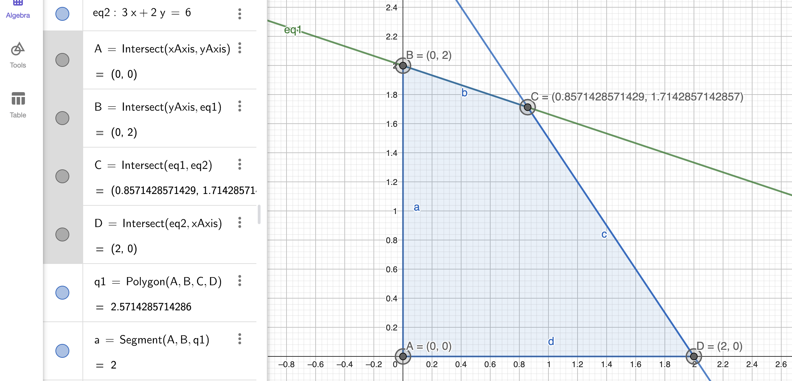

### Función objetivo

$\textrm{Max}Z=2x_1+3x_2$

### Restricciones:
$R_1 \to x_1+3x_2 \leq 6$

$R_2 \to 3x_1+2x_2 \leq 6$

$R3 \to x_1,x_2 \geq 0$

1. Convertimos las restricciones a ecuaciones

$R_1 \to x_1+3x_2+s_1=6$

$R_2 \to 3x_1+2x_2+s_2=6$

2. Obtener la cantidad de puntos esquina

> $m=\textrm{numero de ecuaciones}$
>
> $n=\textrm{numero de variables}$
>
> Para calcular la cantidad de puntos de esquina
> $C_m^n=\frac{n!}{m(n-m)!}$

$m=2, n=4$

$C_m^n=\frac{n!}{m(n-m)!}=\frac{4!}{2(4-2)!}=6$

3. Modelo algebraico

| Variables no básicas | Variables básicas | Solución                            | Puntos Esquina | ¿Es factible? | $Z=2x_1+3x_2$         |
| -------------------- | ----------------- | ----------------------------------- | -------------- | ------------- | --------------------- |
| $x_1, x_2$           | $s_1, s_2$        | $s_1=6, s_2=6$                      | A              | Si            | $Z=0$                 |
| $x_1, s_1$           | $x_2, s_2$        | $x_2=2, s_2=2$                      | B              | Si            | $Z=6$                 |
| $x_1, s_2$           | $x_2, s_1$        | $x_2=3, s_1=-3$                     | C              | No            | ---                   |
| $x_2, s_1$           | $x_1, s_2$        | $x_1=6, s_2=-12$                    | D              | N0            | ---                   |
| $x_2, s_2$           | $x_1, s_1$        | $x_1=2, s_1=4$                      | E              | Si            | $Z=4$                 |
| $s_1, s_2$           | $x_1, x_2$        | $x_1=\frac{6}{7}, x_2=\frac{12}{7}$ | ==F==          | Si            | $Z=\frac{48}{7}=6.85$ |

### Punto A
$x_1=0,x_2=0$

$R_1 \to x_1+3x_2+s_1=6$

$R_1 \to (0)+3(0)+s_1=6$

$R_1 \to$==$s_1=6$==

$R_2 \to 3x_1+2x_2+s_2=6$

$R_2 \to 3(0)+2(0)+s_2=6$

$R_2 \to$==$s_2=6$==

### Punto B

$x_1=0,s_1=0$

$R_1 \to x_1+3x_2+s_1=6$

$R_1 \to (0)+3x_2+(0)=6$

$R_1 \to x_2=\frac{6}{3}\to$==$x_2=2$==

$R_2 \to 3x_1+2x_2+s_2=6$

$R_2 \to 3(0)+2(2)+s_2=6$

$R_2 \to s_2=6-4\to$==$s_2=2$==

### Punto C

$x_1=0,s_2=0$

$R_1 \to x_1+3x_2+s_1=6$

$R_1 \to (0)+3x_2+s_1=6$

$R_1 \to 3x_2+s_1=6$

$R_2 \to 3x_1+2x_2+s_2=6$

$R_2 \to 3(0)+2x_2+(0)=6$

$R_2 \to x_2=\frac{6}{2}\to$==$x_2=3$==

$R_1 \to 3(3)+s_1=6$

$R_1 \to s_1=6-9\to$==$s_1=-3$==

### Punto D

$x_2=0,s_1=0$

$R_1 \to x_1+3x_2+s_1=6$

$R_1 \to x_1+3(0)+(0)=6$

$R_1 \to$==$x_1=6$==

$R_2 \to 3x_1+2x_2+s_2=6$

$R_2 \to 3(6)+2(0)+s_2=6$

$R_2 \to s_2=6-18\to$==$s_2=-12$==

### Punto E

$x_2=0,s_2=0$

$R_1 \to x_1+3x_2+s_1=6$

$R_1 \to x_1+3(0)+s_1=6$

$R_1 \to x_1+s_1=6$

$R_2 \to 3x_1+2x_2+s_2=6$

$R_2 \to 3x_1+2(0)+(0)=6$

$R_2 \to x_1=\frac{6}{3}\to$==$x_1=2$==

$R_1 \to (2)+s_1=6$

$R_1 \to s_1=6-2\to$==$s_1=4$==

### Punto F

$s_1=0,s_2=0$

$R_1 \to x_1+3x_2+s_1=6$

$R_1 \to x_1+3x_2+(0)=6$

$R_1 \to x_1+3x_2=6$

$R_2 \to 3x_1+2x_2+s_2=6$

$R_2 \to 3x_1+2x_2+(0)=6$

$R_2 \to 3x_1+2x_2=6$

$R_1 \to x_2=\frac{6-x_1}{3}=2-\frac{1}{3}x_1$

$R_2 \to 3x_1+2(2-\frac{1}{3}x_1)=6$

$R_2 \to 3x_1+4-\frac{2}{3}x_1=6$

$R_2 \to \frac{7}{3}x_1=6-4=2$

$R_2 \to x_1=\frac{(3)(2)}{7}\to$==$x_1=\frac{6}{7}$==

$R_1 \to x_2=2-\frac{1}{3}(\frac{6}{7})=\frac{14}{7}-\frac{2}{7}\to$==$x_2=\frac{12}{7}$==

4. Comprobación con el modelo gráfico:
