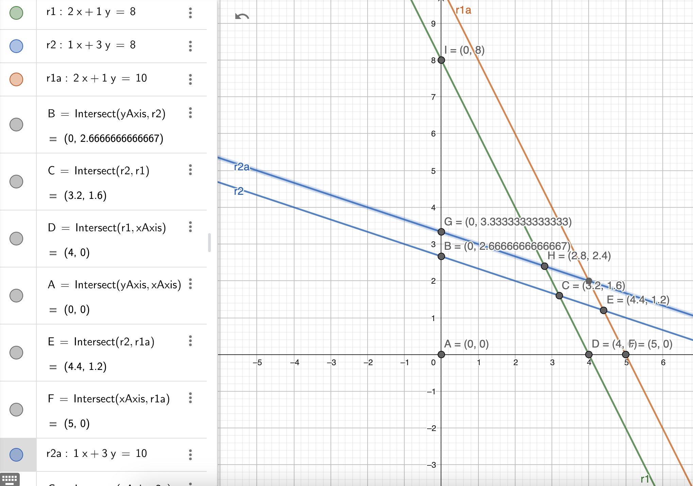
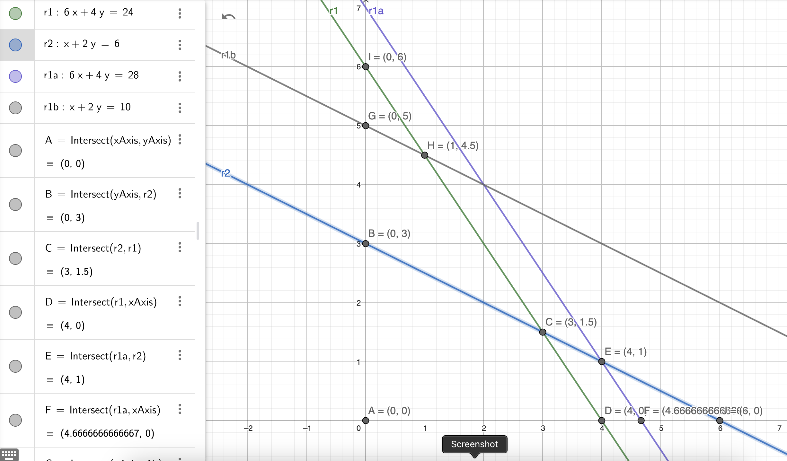

# Analisis de sensibilidad
Cambios en la disponibilidad de recursos.
Otro cambio que podemos analizar, son cambios en los coeficientes de la función objetivo.

¿Qué pasa si debo hacer un recorte, en que linea de producción se debería hacer para afectar menos a la función objetivo.

Jacobo fabrica 2 productos en 2 máquinas, una unidad del producto 1 requiere 2h en la máquina 1 y 1h en la máquina 2, del producto 2 requiere 1h y 3h respectivamente. Los ingresos por unidad de los productos 1 y 2 son $30 y $20 respectivamente. El tiempo de procesamiento diario total disponible en cada máquina es de 8hrs.
1. Variables:

    $\textrm{ producto }_1 \to x_1$

    $\textrm{ producto }_2 \to x_2$

2. Función objetivo

    $\textrm{ MaxZ } = 30x_1 + 20x_2$

3. Restricciones

    $\textrm{ Disp. Maquina }_1 \to \textrm{ R }_1 : 2x_1 + x_2 \leq 8$

    $\textrm{ Disp. Maquina }_2 \to \textrm{ R }_2 : 1x_1 + 3x_2 \leq 8$

    $\textrm{ R }_3 : x_1, x_2 \geq 0$

4. Graficar

    

5. Puntos esquina

    |$PE$ |$x1, x2$ | $Z = 30x_1 + 20x_2$|
    |-|-|-|
    | $A$ | $0,0$ | $Z=0$ |
    | $B$ | $0, 2.66$ | $Z=53.32$ |
    | $C$ | $3.2, 1.6$ | $Z=128$ |
    | $D$ | $4,0$ | $Z=120$ |

6. Mover restricción 1 para obtener una $Z_b$

    $\textrm{ Disp. Maquina }_1 \to \textrm{ R }_1 : 2x_1 + x_2 \leq 10$
        
    |$PE$ |$x1, x2$ | $Z = 30x_1 + 20x_2$|
    |-|-|-|
    | $A$ | $0,0$ | $Z=0$ |
    | $B$ | $0, 2.66$ | $Z=53.32$ |
    | $E$ | $4.4, 1.2$ | $Z=156$ |
    | $F$ | $5,0$ | $Z=150$ |

    6.1. Precio Dual

    $\frac{Z_b - Z_a}{L_{Z_b} - L_{Z_a}} = \frac{156-128}{10-8}=14$
    
    Implica que sumar o quitar 1 unidad en la $\textrm{ Disp. Maquina }_1$ afectará en $14$ al valor de $Z$.

    6.2. Intervalo de factibilidad

    $2.66 \leq \textrm{ Disp. Maquina }_1 \leq 16$

7. Mover la restricción de la máquina 2 para obtener una $Z_c$

    $\textrm{ Disp. Maquina }_2 \to \textrm{ R }_2 : 1x_1 + 3x_2 \leq 10$
        
    |$PE$ |$x1, x2$ | $Z = 30x_1 + 20x_2$|
    |-|-|-|
    | $A$ | $0,0$ | $Z=0$ |
    | $G$ | $0, 3.33$ | $Z=66.6$ |
    | $H$ | $2.8, 2.4$ | $Z=132$ |
    | $D$ | $4,0$ | $Z=120$ |

    7.1. Precio Dual

    $\frac{Z_c - Z_a}{L_{Z_c} - L_{Z_a}} = \frac{132-128}{10-8}=2$
    
    Implica que sumar o quitar 1 unidad en la $\textrm{ Disp. Maquina }_2$ afectará en $2$ al valor de $Z$.

    7.2 Intervalo de factibilidad
    | | | |
    |-|-|-|
    | $\textrm{Punto D} \to (4,0)$ | $1x_1 + 3x_2 \to 1(4) + 3(0)$ | $4$ |
    | $\textrm{Punto I} \to (0,8)$ | $1x_1 + 3x_2 \to 1(0) + 3(8)$ | $24$ |

    $4 \leq \textrm{ Disp. Maquina }_2 \leq 24$

## Ejercicio
Obtener precio dual e intervalo de factibilidad de materia prima 1 y 2 del ejercicio de Reddy Miks.

1. Variables

    $\textrm{Materia Prima}_1 \to x_1$

    $\textrm{Materia Prima}_2 \to x_2$

2. Funcion objetivo

    $\textrm{ MaxZ } = 5x_1 + 4x_2$

3. Restricciones

    $\textrm{ Disp. Materia P. }_1 \to \textrm{ R }_1 : 6x_1 + 4x_2 \leq 24$

    $\textrm{ Disp. Materia P. }_2 \to \textrm{ R }_2 : x_1 + 2x_2 \leq 6$

4. Graficar

    

5. Puntos esquina
    |$PE$ |$x1, x2$ | $Z = 5x_1 + 4x_2$|
    |-|-|-|
    | $A$ | $0,0$ | $Z=0$ |
    | $B$ | $0,3$ | $Z=12$ |
    | $C$ | $3,1.5$ | $Z=21$ |
    | $D$ | $4,0$ | $Z=20$ |

6. Mover restricción 1 para obtener una $Z_b$

    $\textrm{ Disp. Materia P. }_1 \to \textrm{ R }_1 : 6x_1 + 4x_2 \leq 28$
   
    |$PE$ |$x1, x2$ | $Z = 5x_1 + 4x_2$|
    |-|-|-|
    | $A$ | $0,0$ | $Z=0$ |
    | $B$ | $0,3$ | $Z=9$ |
    | $E$ | $4,1$ | $Z=24$ |
    | $F$ | $4.66,0$ | $Z=23.3$ |

    6.1. Precio Dual

    $\frac{Z_b - Z_a}{L_{Z_b} - L_{Z_a}} = \frac{24-21}{28-24}=0.75$
    
    Implica que sumar o quitar 1 unidad en la $\textrm{ Disp. Maquina }_1$ afectará en $14$ al valor de $Z$.

    6.2. Intervalo de factibilidad

    | | |
    |-|-|-|
    | $\textrm{Punto B} \to (0,3)$ | $6x_1 + 4x_2 \to 6(0) + 4(3)$ | $12$ |
    | $\textrm{Punto J} \to (6,0)$ | $6x_1 + 4x_2 \to 6(6) + 4(0)$ | $36$ |

    $12 \leq \textrm{ Disp. Materia P. }_1 \leq 36$

7. Mover la restricción de la máquina 2 para obtener una $Z_c$

    $\textrm{ Disp. Materia P. }_2 \to \textrm{ R }_2 : x_1 + 2x_2 \leq 6$

    |$PE$ |$x1, x2$ | $Z = 5x_1 + 4x_2$|
    |-|-|-|
    | $A$ | $0,0$ | $Z=0$ |
    | $G$ | $0,5$ | $Z=20$ |
    | $H$ | $1,4.5$ | $Z=23$ |
    | $D$ | $4,0$ | $Z=20$ |

    7.1. Precio Dual

    $\frac{Z_c - Z_a}{L_{Z_c} - L_{Z_a}} = \frac{23-21}{10-6}=0.5$
    
    Implica que sumar o quitar 1 unidad en la $\textrm{ Disp. Maquina }_2$ afectará en $2$ al valor de $Z$.

    7.2 Intervalo de factibilidad
    
    | | | |
    |-|-|-|
    | $\textrm{Punto D} \to (4,0)$ | $ x_1 + 2x_2 \to 1(4) + 2(0)$ | $4$ |
    | $\textrm{Punto I} \to (0,6)$ | $ x_1 + 2x_2 \to 1(0) + 2(6)$ | $12$ |

    $4 \leq \textrm{ Disp. Materia P. }_2 \leq 12$
