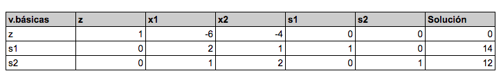

# Pregunta 8
Considerando el siguiente modelo PL

$Maximizar z = 3x_1 + 4x_2$

Sujeto a

$x_1 + 7x_2 \leq 8$

$2x_1 + 4x_2 \geq 12$

$x_1, x_2 \geq 0$

¿Cuantas variables de holgura, superavit y variables artificiales debe
incluir el modelo?

$x_1 + 7x_2 + s_1 = 8$

$2x_1 + 4x_2 - S_1 + R_1 = 12$

**Respuesta: 1 Holgura, 1 Superavit y 1 variable artificial**

# Pregunta 9

De acuerdo a método Simplex determine:

En la siguiente tabla Inicial, cual es la variable que se debe elegir como entrada y cuál es la variable de salida?, cuando se pretende máximizar z.

$\textrm{Variable de entrada} = x_1$

| $V_B$ | Columna $V_E$ | $Solución$ | Relación mínima     | ¿Factible? |
| ----- | ------------- | ---------- | ------------------- | ---------- |
| $s_1$ | $2$           | $14$       | $\frac{14}{2} = 7$  | Sí         |
| $s_2$ | $1$           | $12$       | $\frac{12}{1} = 12$ | Sí         |

**Respuesta: $x_1,s_1$ son las variables de entrada y salida**